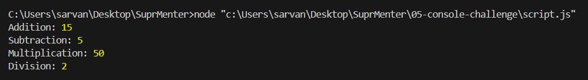

# 05 — Console Challenge

**Assignment Date:** 24/02/2026
**Assignment:** Write JS programs for calculator operations inside the browser console.

---

## Output



---

## What I Built

A JavaScript file with basic calculator functions (add, subtract, multiply, divide) that run and display results in the terminal/browser console.

---

## Features

- Four calculator functions: `add`, `subtract`, `multiply`, `divide`
- Division by zero check with an error message
- Console output for all operations

---

## Technologies Used

- JavaScript (Vanilla)
- Node.js (to run in terminal)

---

## Project Structure

```
05-console-challenge/
│
├── script.js       # Calculator functions and console test outputs
└── Screenshot.png  # Terminal output screenshot
```

---

## How to Run

```bash
node script.js
```

---

## What I Learned

- How to write and call functions in JavaScript
- How to handle edge cases (like divide by zero)
- How to use `console.log()` to test and debug output

---

## Author

**Sarvan D Suvarna** — Part of MERN Stack Internship @ SuprMentr Technologies