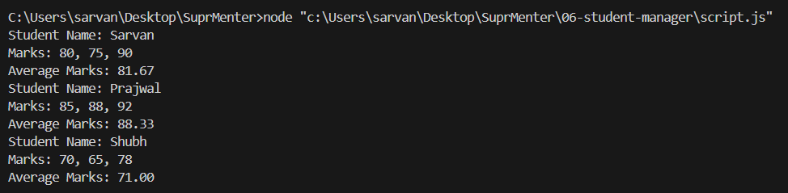

# 06 — Student Manager

**Assignment Date:** 28/02/2026
**Assignment:** Use arrays & objects to store student marks and calculate averages.

---

## Output



---

## What I Built

A JavaScript program that stores student data using arrays and objects, then loops through each student to calculate and display their average marks in the console.

---

## Features

- Student data stored as an array of objects (name + marks array)
- `calculateAverage()` function using `reduce()`
- Loops through all students and logs name, marks, and average
- Average displayed to 2 decimal places

---

## Technologies Used

- JavaScript (Vanilla)
- Node.js (to run in terminal)

---

## Project Structure

```
06-student-manager/
│
├── script.js       # Student data, average calculation, console output
└── Screenshot.png  # Terminal output screenshot
```

---

## How to Run

```bash
node script.js
```

---

## What I Learned

- How to work with arrays of objects in JavaScript
- How to use `reduce()` to sum values
- How to use `forEach()` to loop through data
- How to format numbers with `toFixed()`

---

## Author

**Sarvan D Suvarna** — Part of MERN Stack Internship @ SuprMentr Technologies