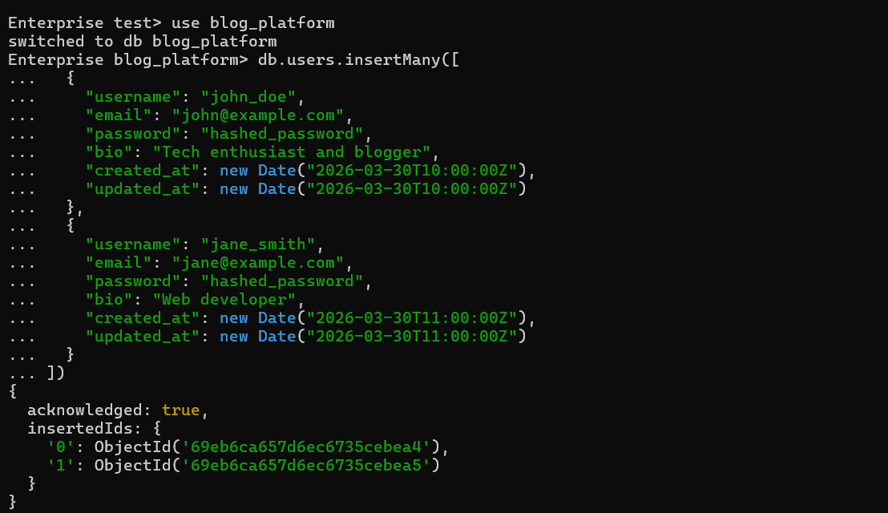
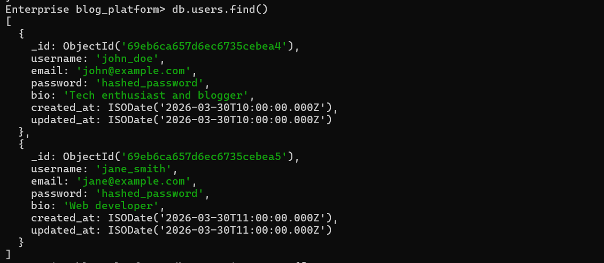
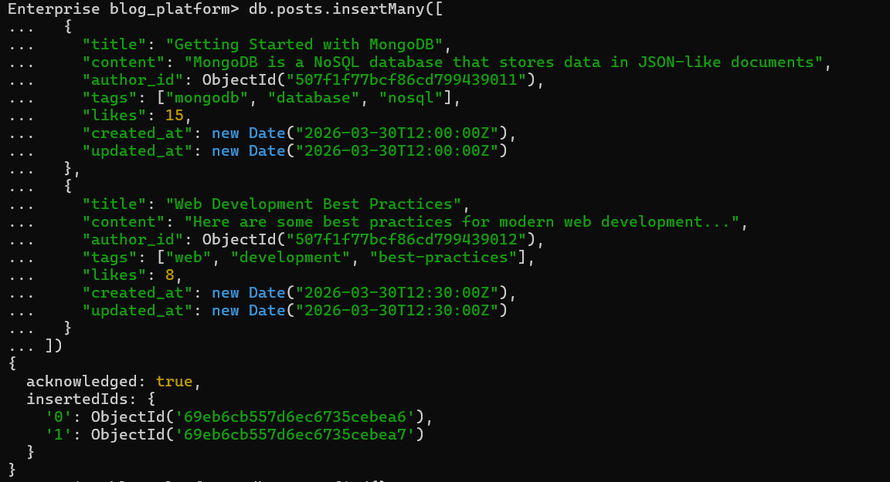
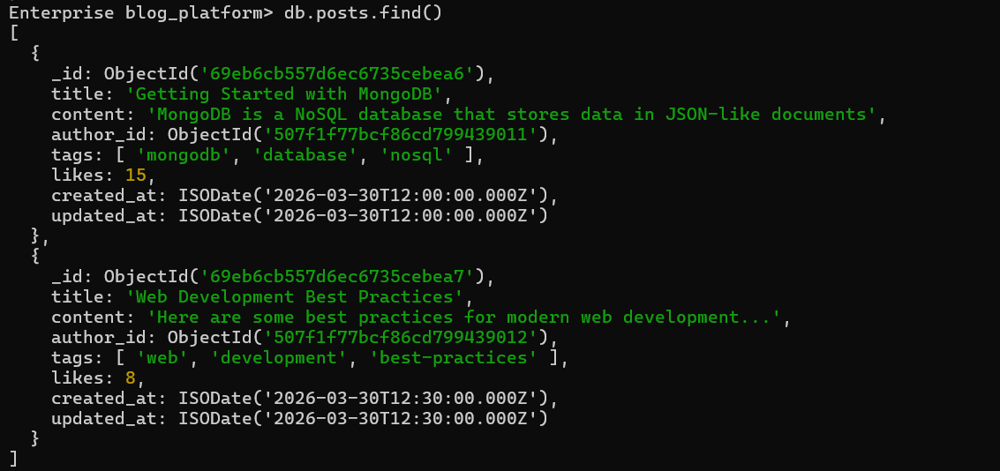
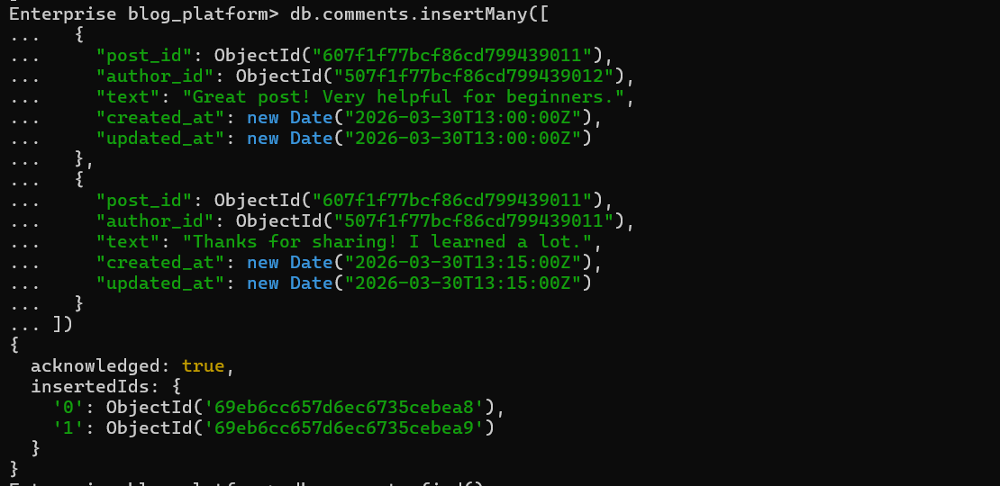
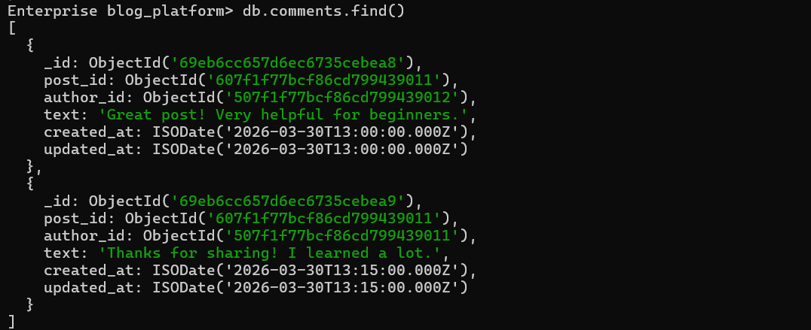
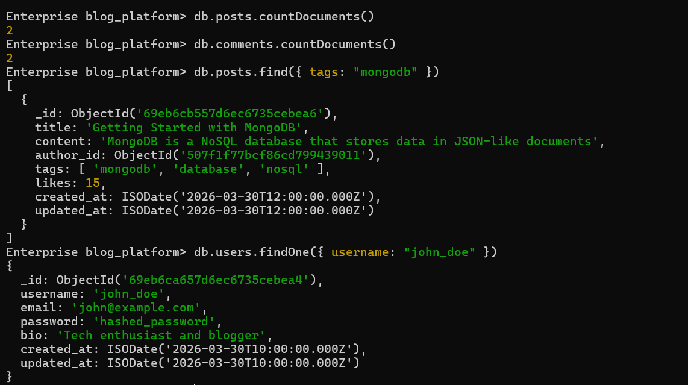

# 20 — Data Modeler

**Assignment Date:** 30/03/2026
**Assignment:** Design a MongoDB schema for a blogging platform.

---

## What I Built

Designed and implemented a comprehensive MongoDB schema for a blogging platform. This involved creating three core collections—**Users**, **Posts**, and **Comments**—with appropriate data types, relationships using `ObjectId` references, and verified data integrity through the MongoDB Shell.

---

## Features

* **User Management:** Profiles with username, email, bio, and timestamps.
* **Content System:** Posts with titles, content, tags, and engagement tracking (likes).
* **Interaction Layer:** Comments referenced to posts and authors via `ObjectId`.
* **Data Integrity:** Used specific MongoDB data types (Date, ObjectId, Arrays, Numbers).
* **Query Operations:** Data retrieval, filtering, and document counting.

---

## Technologies Used

* MongoDB (NoSQL Database)
* MongoDB Shell (Mongosh)

---

## Schema Design

### Collections Overview

**1. Users Collection** — Stores user profiles
- `_id` (ObjectId): Unique identifier
- `username` (String): Unique username
- `email` (String): Unique email
- `password` (String): Hashed password
- `bio` (String): User biography
- `created_at` (Date): Account creation timestamp
- `updated_at` (Date): Last update timestamp

**2. Posts Collection** — Stores blog posts
- `_id` (ObjectId): Unique identifier
- `title` (String): Post title
- `content` (String): Post content
- `author_id` (ObjectId): References Users collection
- `tags` (Array): Blog post tags
- `likes` (Number): Like count
- `created_at` (Date): Creation timestamp
- `updated_at` (Date): Last update timestamp

**3. Comments Collection** — Stores comments on posts
- `_id` (ObjectId): Unique identifier
- `post_id` (ObjectId): References Posts collection
- `author_id` (ObjectId): References Users collection
- `text` (String): Comment text
- `created_at` (Date): Creation timestamp
- `updated_at` (Date): Last update timestamp

### Schema Design Rationale

Used **referencing** (linking) instead of embedding for this architecture because:
- **Lean Documents:** Keeps the post and user documents from growing too large.
- **Scalability:** Better handles posts that might eventually have thousands of comments.
- **Flexibility:** Allows updating user profiles (like changing a username) without having to update every single comment or post document.
- **Independent Querying:** Makes it easy to fetch all comments by a specific user across different posts.

---

## Implementation & Testing

I verified the schema by performing the following operations in the MongoDB Shell:

### 1. User Management
Successfully inserted multiple users and verified their storage in the database.

### 2. Post Creation
Created blog posts with various tags and linked them to authors using `author_id`.

### 3. Engagement & Comments
Added comments linked to both the specific post and the commenting user.

### 4. Advanced Queries & Aggregation
Performed document counting and filtered searches (e.g., finding all posts tagged with "mongodb").

---

## What I Learned

* Designing NoSQL schemas with relationships using `ObjectId` references.
* Understanding the trade-offs between **Embedding** and **Referencing** in MongoDB.
* Working with MongoDB data types (Date, ObjectId, Arrays, Numbers).
* Performing bulk data insertion with `insertMany()`.
* Executing CRUD and filtering operations via the MongoDB Shell.
* Using basic aggregation methods like `countDocuments()`.

---

## Author

**Sarvan D Suvarna** — Part of MERN Stack Internship @ SuprMentr Technologies
