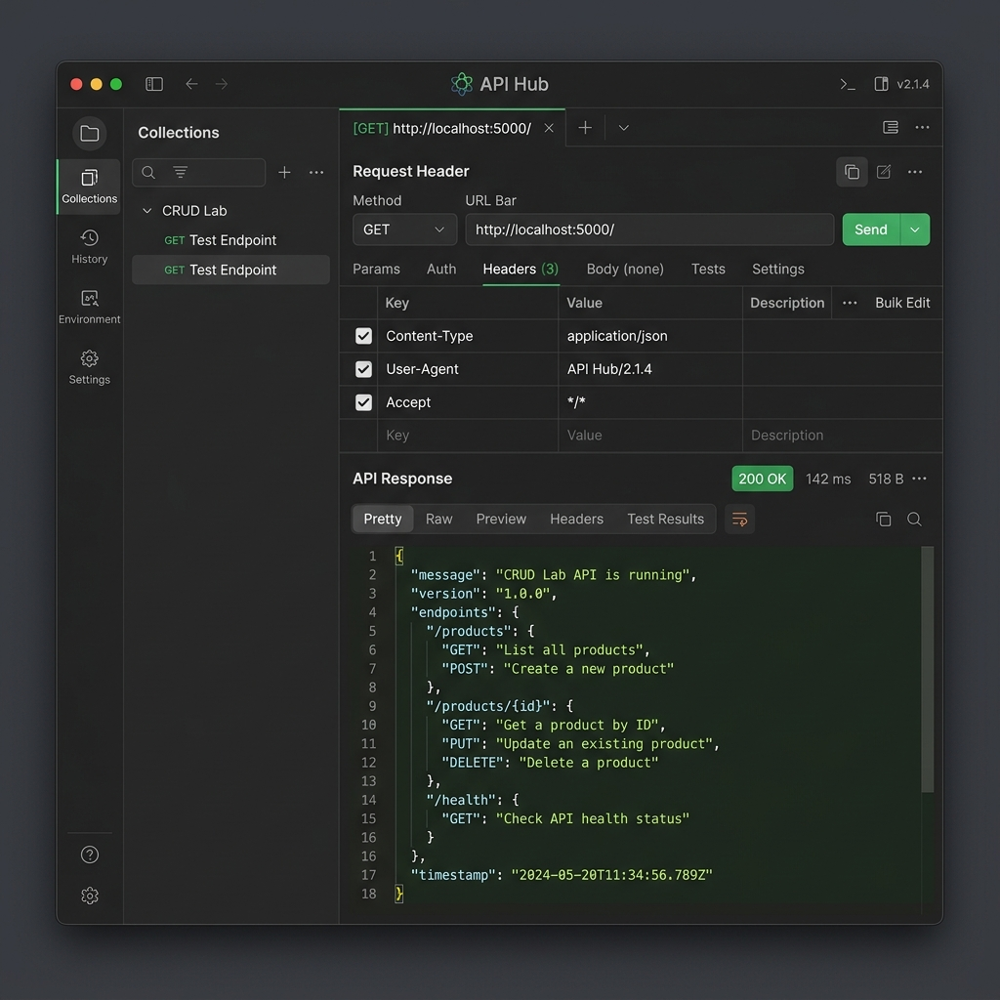
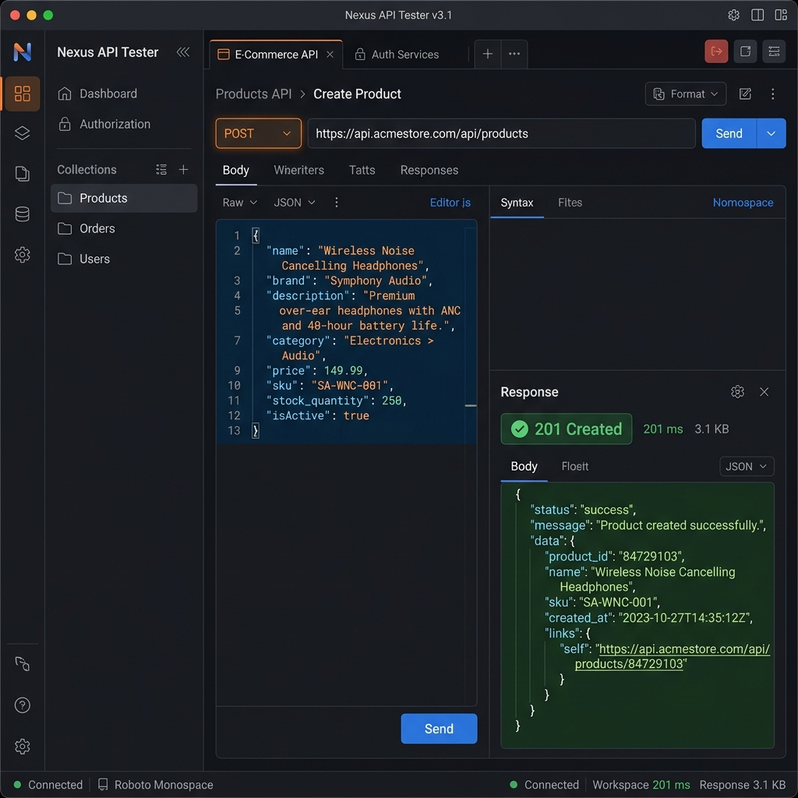
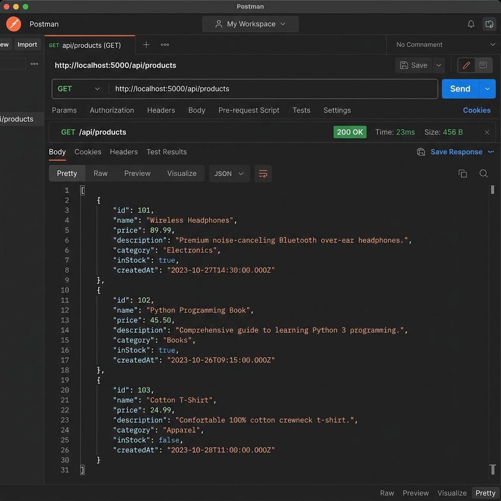

# 21 — CRUD Lab

**Assignment Date:** 03/04/2026
**Assignment:** Implement full CRUD operations for a Product management system using Express and Mongoose.

---

## What I Built

Developed a complete RESTful API for managing a product catalog. This lab involved setting up a MongoDB connection via Mongoose, defining a schema with built-in validations, and implementing endpoints for Creating, Reading, Updating, and Deleting products.

---

## Features

* **Complete CRUD:** POST, GET, PUT, and DELETE endpoints for full data lifecycle management.
* **Mongoose Schema:** Structured data model with type validation (String, Number, Boolean) and required fields.
* **Category Filtering:** Specialized endpoint to retrieve products by specific categories.
* **Data Validation:** Prevents invalid data (e.g., negative prices or stocks) using Mongoose built-in validators.
* **Clean Response Envelopes:** Standardized JSON responses for all API calls.

---

## Technologies Used

* Node.js
* Express.js
* MongoDB
* Mongoose (ODM)
* Thunder Client (API Testing)

---

## Project Structure

```
21-crud-lab/
├── db.js            # MongoDB connection logic
├── Product.js       # Mongoose Schema & Model
├── server.js        # Express app and CRUD routes
├── crud.js          # Utility functions for CRUD operations
├── package.json     # Project dependencies
├── seed.js          # Database seeding script
└── screenshots/     # API testing verification
```

---

## API Endpoints Summary

| Method | Endpoint | Description |
| :--- | :--- | :--- |
| **GET** | `/` | Test API & show available endpoints |
| **POST** | `/api/products` | Create a new product |
| **GET** | `/api/products` | Get all products |
| **GET** | `/api/products/:id` | Get a specific product by ID |
| **GET** | `/api/products/category/:category` | Filter products by category |
| **PUT** | `/api/products/:id` | Update product details |
| **DELETE** | `/api/products/:id` | Remove a single product |
| **DELETE** | `/api/products` | Wipe all products (Bulk Delete) |

---

## Implementation & Testing

The API was thoroughly tested using **Thunder Client**. Below are the verification screenshots of the key operations.

### 1. API Status Check
Verified that the server and database are connected and running.


### 2. Creating Products
Successfully created new product documents with proper validation.


### 3. Retrieving All Products
Fetched the entire product list to verify successful insertion and schema structure.


---

## What I Learned

* Connecting Express to MongoDB using **Mongoose**.
* Designing schemas with **validation** rules (required, min, max, enum).
* Implementing **Async/Await** for clean database operations and error handling.
* Using **Express params** (`:id`, `:category`) for dynamic routing.
* Difference between `POST` (create) and `PUT` (update) operations.
* Best practices for testing APIs using environment-agnostic tools.

---

## Author

**Sarvan D Suvarna** — Part of MERN Stack Internship @ SuprMentr Technologies
