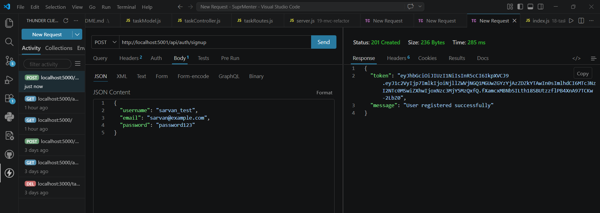
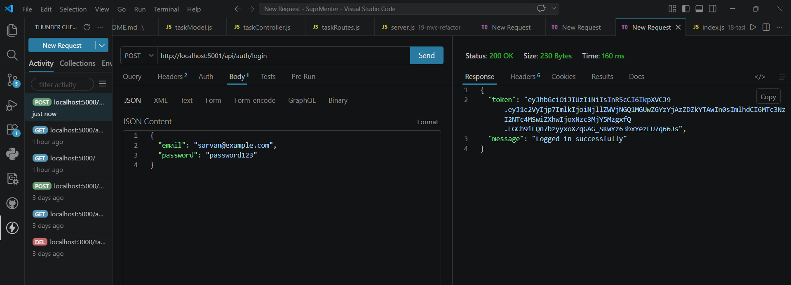
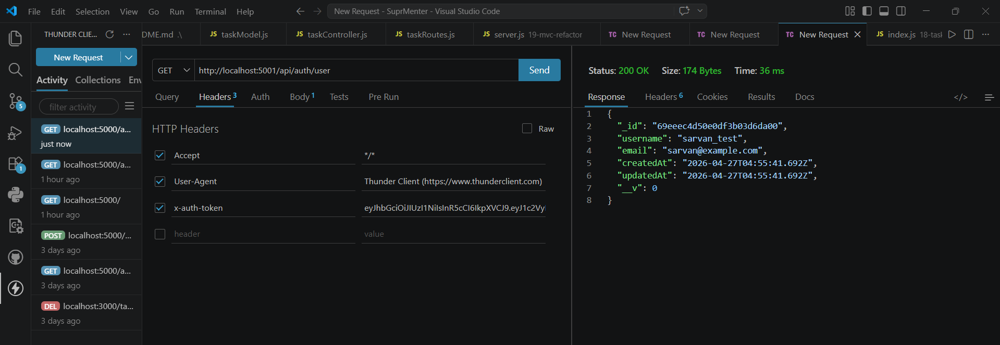

# 21 — Secure Login

**Assignment Date:** 06/04/2026
**Assignment:** Build a secure signup/login system with password hashing and JWT authentication.

---

## What I Built

Implemented a production-ready authentication system using **Node.js**, **Express**, and **MongoDB**. The application focuses on security best practices by never storing plain-text passwords and using **JSON Web Tokens (JWT)** for stateless session management.

---

## Features

* **Secure Password Hashing:** Uses `bcryptjs` with auto-generated salts to protect user passwords in the database.
* **JWT Authentication:** Generates cryptographically signed tokens upon successful signup/login.
* **Protected Routes:** Custom middleware to verify JWT tokens before allowing access to private user data.
* **Mongoose Middleware:** Automatic password hashing using the `.pre('save')` hook in the User model.
* **Environment Security:** Uses `.env` for managing sensitive secrets like the JWT key and database URI.

---

## Technologies Used

* Node.js & Express.js
* MongoDB & Mongoose
* **bcryptjs** (Password hashing)
* **jsonwebtoken** (Authentication tokens)
* **dotenv** (Environment variables)

---

## Implementation Verification

### 1. User Registration (Signup)
The password is automatically hashed before being saved to MongoDB.

### 2. User Authentication (Login)
Verification of credentials and generation of a secure JWT token.

### 3. Protected Route Authorization
Accessing restricted data using the JWT token in the request header.

---

## What I Learned

* Why **password hashing** is critical for security and why we use `bcrypt`.
* How **JWT** works (Header.Payload.Signature) and why it's better for APIs than cookies.
* Implementing **Express Middleware** to protect specific routes.
* Using Mongoose schema methods and hooks to modularize logic.
* Managing secrets securely using environment variables.

---

## Author

**Sarvan D Suvarna** — Part of MERN Stack Internship @ SuprMentr Technologies
