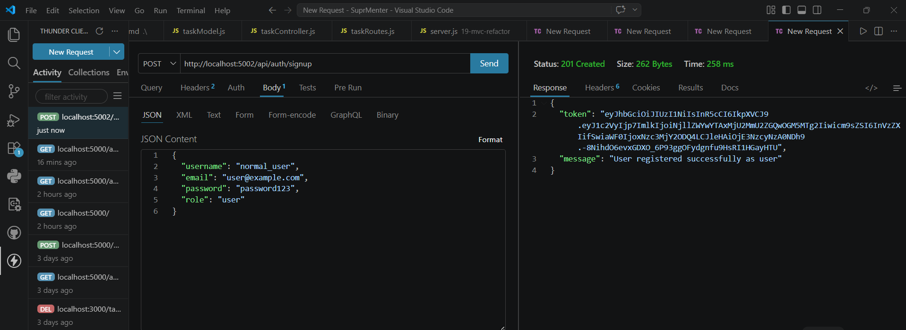
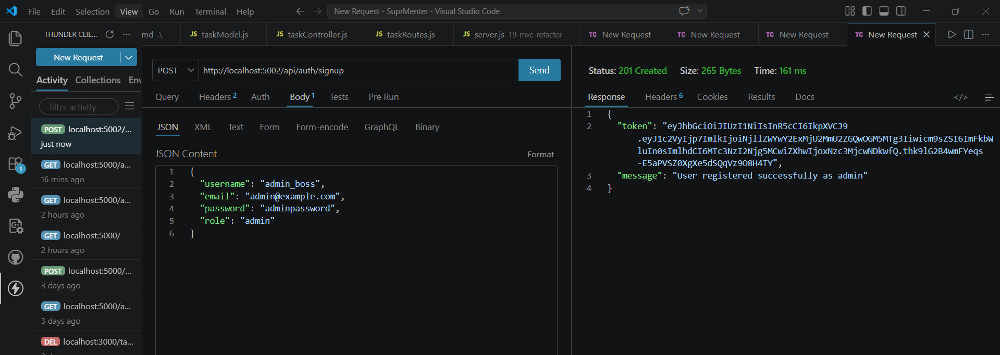
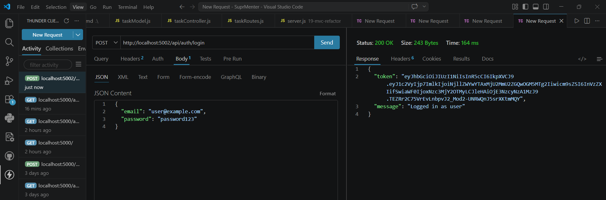
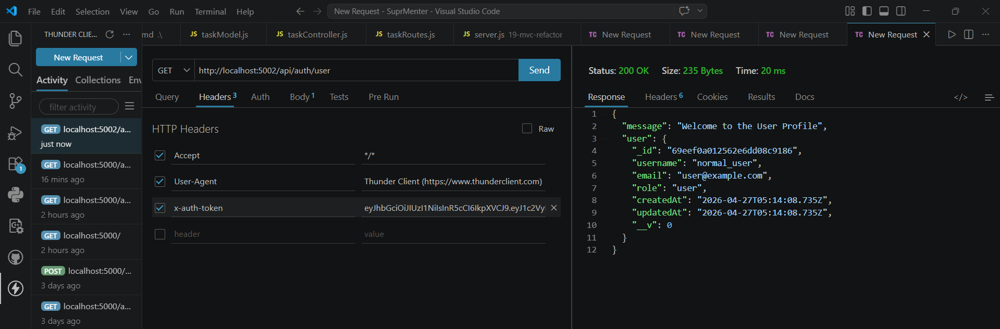
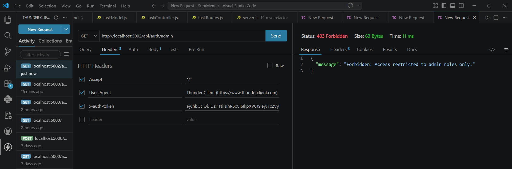

# 22 — Role Guard

**Assignment Date:** 08/04/2026
**Assignment:** Implement Role-Based Access Control (RBAC) to restrict specific routes to Admin users only.

---

## What I Built

Enhanced the authentication system by adding user roles. This allows the application to differentiate between a standard **User** and an **Admin**, ensuring that sensitive routes (like user management dashboards) are only accessible to authorized personnel.

---

## Features

* **Role-Based Access Control (RBAC):** Custom middleware that validates user roles against a permitted list before allowing access to a route.
* **Expanded User Model:** Added a `role` field with `enum` validation (`user` or `admin`).
* **Bespoke Error Handling:** Differentiates between **401 Unauthorized** (not logged in) and **403 Forbidden** (logged in but lacks permission).
* **Token-Encoded Roles:** User roles are baked directly into the JWT payload for efficient permission checking without constant database lookups.
* **Admin Dashboard:** A protected route that allows admins to view all registered users.

---

## Technologies Used

* Node.js & Express.js
* MongoDB & Mongoose
* JSON Web Tokens (JWT)
* bcryptjs (Password security)

---

## Implementation Verification

### 1. User/Admin Registration
The system correctly assigns roles during signup.

### 2. Standard User Access
A user can access their profile but is blocked from administrative areas.

### 3. Admin Authorization
Admins have full access to the management dashboard.

---

## What I Learned

* The difference between **Authentication** (Who are you?) and **Authorization** (What can you do?).
* Implementing **Higher-Order Functions** in middleware.
* Using Mongoose `enum` to strictly define allowed values for a field.
* Best practices for communicating permission errors to the frontend.

---

## Author

**Sarvan D Suvarna** — Part of MERN Stack Internship @ SuprMentr Technologies
